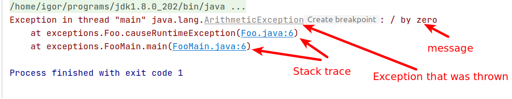

## Exceptions are two types: 

* Runtime (unchecked) - example: FileNotFoundException  
* Compile (checked)  - example: IOException

## Example of a stack trace:

```
Exception in thread "main" java.lang.ArithmeticException: / by zero
  at exceptions.Foo.causeRuntimeException(Foo.java:6)
  at exceptions.FooMain.main(FooMain.java:6)
```

## Definition

> An exception is a mechanism for  handling exceptional conditions. 


## Example stack trace: 




## Checked and unchecked exceptions

* Runtime: called because you learn about it the hard way - at run time is shit hits the fan.
* Checked: forces you to try anc catch, because it would not compile.